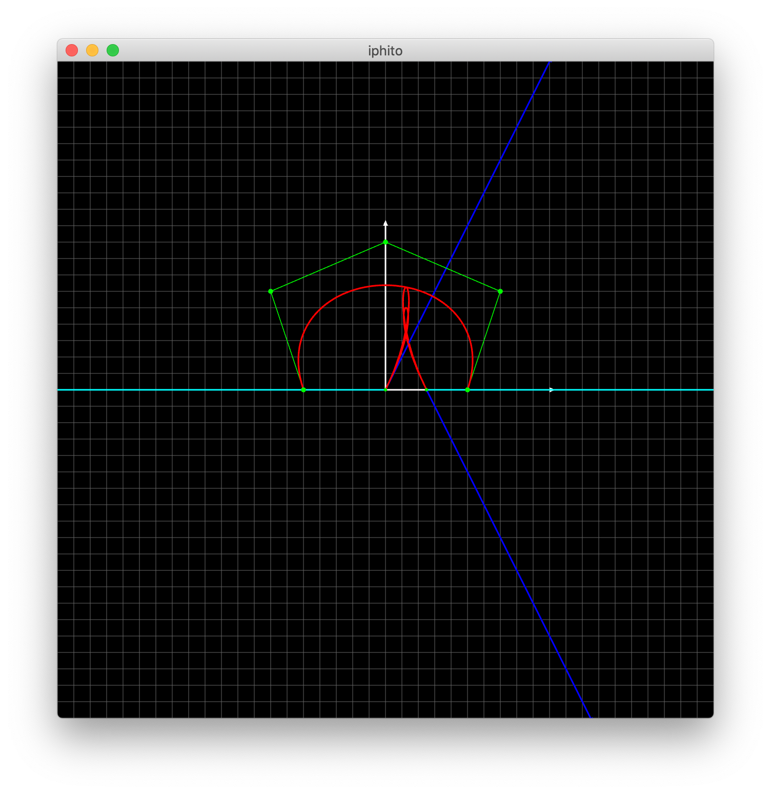

Iphito
======

*A small curve editor for educational purposes.*

.. contents::
   :backlinks: top

.. sectnum::

This small cross-platform curve visualizer supports displaying cubic, quintic
Hermite and Bézier curves.

Requirements
------------

* a c++ compiler that supports >= c++17
* Meson and Ninja

Build
-----

.. code:: bash

   $ meson setup build
   $ meson compile -C build

The built executable will then be in :code:`build/`.

Usage
-----

Inside the :code:`build` folder, execute:

.. code:: bash

    $ iphito show "bezier [ (-0.5, 0), (-0.7, 0.6), (0.0, 0.9), (0.7, 0.6), (0.5, 0) ]"
    $ # or with the curve definitions inside a file
    $ iphito -f ../example.iphito

use

* :code:`bezier` for Bézier curves
* :code:`hermite3` for cubic Hermite curves
* :code:`hermite5` for quintic Hermite curves
